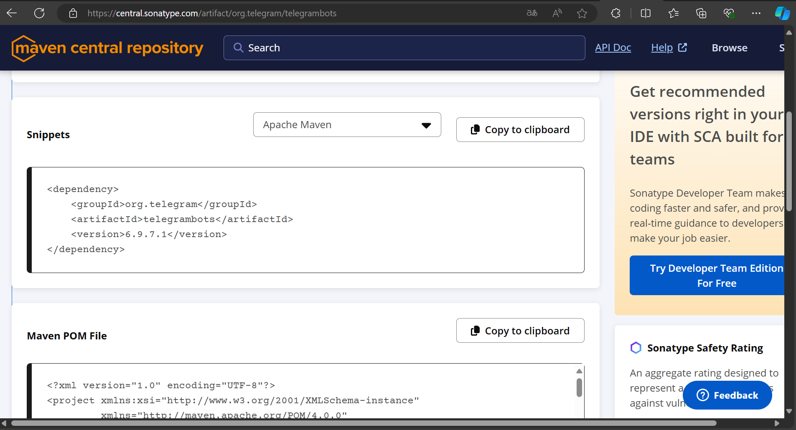
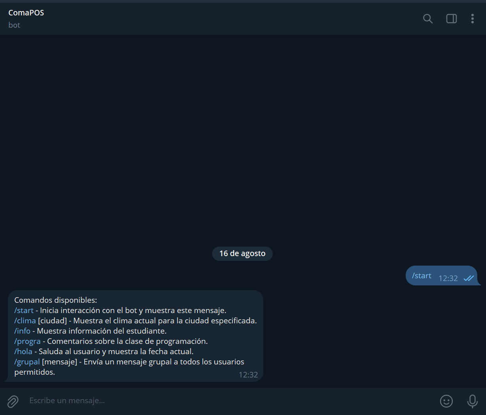
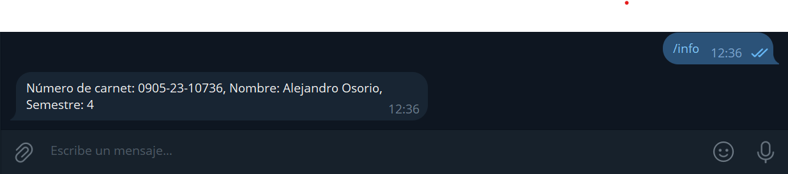
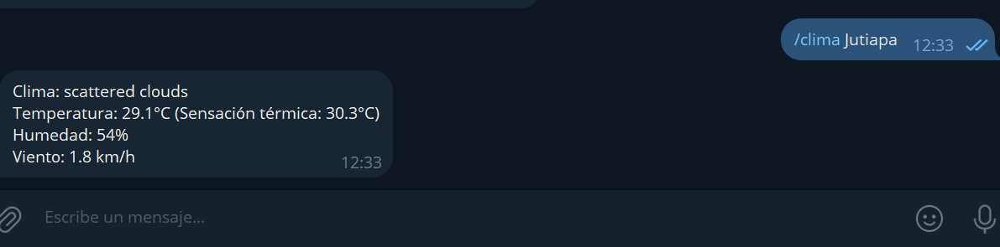
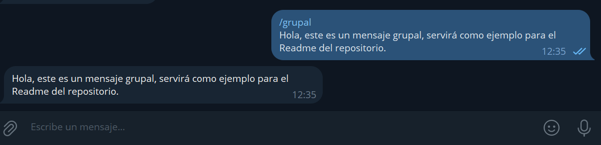

# tareaBot

## Descripción
**tareaBot** es un bot de Telegram diseñado para proporcionar información meteorológica en tiempo real y tasas de cambio de EUR a otras monedas. Utiliza API externas para recopilar y entregar datos precisos y actualizados sobre la demanda de los usuarios.

## Características
- **Clima en Tiempo Real**: Proporciona detalles del clima como temperatura, humedad, y condiciones meteorológicas para cualquier ciudad especificada por el usuario.
- **Conversión de Moneda**: Calcula el valor actual del euro frente a otras monedas principales utilizando datos en tiempo real.

## Tecnologías Utilizadas
- Java
- Telegram Bot API 
- OpenWeatherMap API para datos meteorológicos
- ExchangeRate-API para tasas de cambio de moneda

  ## Ejemplos del bot
- Start   
- Info 
- Cambio de euros 
- Clima 
- Grupal 
- Otros ejemplos
